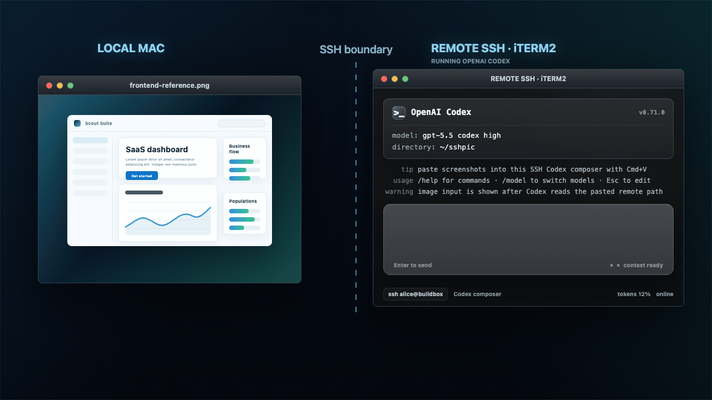

# sshpic

🖼️ Paste local screenshots into remote SSH coding-agent terminals with the normal paste shortcut: `Cmd+V` on the supported macOS + iTerm2 path, or `Ctrl+V` on the experimental Windows + WezTerm release candidate.




## ✨ Before / After

```text
Before: screenshot → leave Codex → upload/scp somehow → copy path → return → paste path
After:  screenshot → stay in Codex → normal paste shortcut → remote image path appears
```

| Moment | Before sshpic | With sshpic |
|---|---|---|
| You capture or copy a screenshot locally | The remote coding flow stops while you move the file. | Your cursor stays in the SSH/Codex input. |
| The image needs to reach the SSH host | You run `scp`, use a cloud link, or type an upload helper. | The normal paste shortcut uploads it over SSH. |
| The terminal receives the result | Extra commands, debug output, or manually copied paths can leak into the prompt. | Only the remote image path is inserted. |
| You do it again | Every screenshot repeats the interruption. | Every screenshot uses the same paste gesture. |

## 🚀 Installation

### 💻 Clone and install

```bash
git clone https://github.com/leekyungmoon/sshpic.git
cd sshpic
./install.sh
```

Use these same three commands for the supported macOS path and the Windows release candidate:

- **macOS:** run them in a normal shell. The installer builds `sshpic`, sets up the macOS clipboard helper when Homebrew is available, creates a config file if needed, removes older sshpic iTerm2 settings, and enables the current iTerm2 `Cmd+V` integration.
- **Windows 10/11 (experimental):** run them in **Git Bash**, not WSL. The installer builds the Windows executable and enables the WezTerm `Ctrl+V` release-candidate integration. If Go or WezTerm is missing and `winget` is available, it uses the normal `winget` package installation path automatically.

`install.sh` normalizes the host as `windows`, `macos`, `linux`, `wsl`, or `unsupported` before installing (`./install.sh --detect-os` prints only the detected value). WSL and unknown platforms stop before dependency installation so they cannot accidentally take the native Windows or macOS path.

If your Mac cannot set up the required iTerm2 support, the installer stops before changing `Cmd+V`. Your normal paste shortcut stays untouched.

On Windows, Git Bash is required only for `./install.sh`. The release-candidate WezTerm pane may run native PowerShell or Git Bash, but the SSH client must be Windows OpenSSH (`ssh.exe`). Windows Terminal and WSL integration remain `TBD`.

### 🧹 Strong Windows uninstall

Run the companion uninstaller from the existing checkout in **Git Bash**:

```bash
./uninstall.sh --dry-run
./uninstall.sh
```

The normal uninstall is a full removal of sshpic's local installed/runtime state. It restores the validated manifest-owned WezTerm changes, deletes and verifies sshpic's local config, cache, log, materialized local images, and strictly named crash-temporary files, and only then removes the exact manifest-bound `sshpic.exe`. A read-only preflight prints the exact plan before confirmation. New installs also record the executable SHA-256, and an uninstall transaction journal keeps the validated binary available for retry if local cleanup or Windows file locking interrupts removal.

The source checkout is kept by default, because it is installation source rather than installed runtime state. This lets a ChatGPT/Codex project rooted at the clone continue to work and permits a later `./install.sh`. To remove that directory too, first move the ChatGPT/Codex project elsewhere and run:

```bash
cd ..
./sshpic/uninstall.sh --purge-source
```

`--purge-source` must be started with the shell's working directory outside the checkout because Windows locks a process working directory. It is deliberately strict: it requires Go plus the selected WezTerm ownership manifest (or an exact completion receipt from an interrupted retry), and refuses a dirty checkout, ignored or untracked files, stashes/custom refs, linked worktrees, reflog-only/unreachable commits, unpublished local branches or tags, stale or manually saved remote-tracking refs, a missing live upstream, or a local HEAD that differs from the live upstream head. The isolated Go helper writes an immutable receipt containing the exact settled install generation and a deterministic sibling quarantine path after installed state is gone. Before the atomic rename it syncs a separate ownership marker; that marker authorizes no-follow cleanup even if a crash leaves only a partially deleted quarantine. The isolated runtime and an exact retry command are preserved when the original root is already unavailable, and a later successful uninstall removes abandoned owned runtimes. A new Windows install publishes an in-progress generation before binary publication. It permanently invalidates a stale receipt only when no bound quarantine or marker exists; otherwise it preserves the recovery state and refuses installation until recovery completes. This is the deletion-equivalent local mode and makes any project still rooted at that directory unusable.

Go, WezTerm, SSH configuration/keys, the current clipboard value, and images already uploaded to SSH servers are not local sshpic-owned runtime state and are not removed. Go and WezTerm may be shared by other software, and the current release has no trustworthy history of every remote host used, so guessing at either would be destructive. Delete remote images separately with an authenticated, host-specific cleanup after reviewing that server.

For the default checkout-preserving uninstall, if Go was removed, `--binary <exact-path>` lets the script copy a binary installed from this uninstall-capable branch as the temporary helper; its path must still match the manifest and the owned WezTerm module. Source purge intentionally does not allow that fallback: it requires Go to remain available so an isolated helper can always be rebuilt if final checkout deletion must be retried. A required uninstall-protocol handshake makes older binaries fail during read-only preflight instead of silently performing only the older partial cleanup; reinstall Go and rerun in that case. A legacy install manifest without a recorded executable SHA-256 cannot prove ownership of a still-present binary, so uninstall refuses before mutation; rerun `./install.sh` once to publish the hash, then uninstall. If Windows keeps the executable locked, close the named process and rerun: the transaction journal retains the exact validated target instead of guessing from `GOBIN`. `--config <path>` selects an exact custom sshpic config file for removal, while `--wezterm-config <path>` selects the WezTerm config whose ownership manifest should be restored. Use `--yes` only when a non-interactive uninstall is intentional.

### 👉 One-liner

```bash
curl -fsSL https://raw.githubusercontent.com/leekyungmoon/sshpic/main/install.sh | bash
```

## ⚡ Quick Start

### Windows + WezTerm (experimental)

After installing from Git Bash:

1. 🖥️ Open WezTerm with native PowerShell or Git Bash.
2. 🔐 Run `ssh.exe my-host` (or `ssh` when that resolves to Windows `ssh.exe`).
3. 🤖 Start Codex in that SSH session.
4. 🖼️ Copy an image to the Windows clipboard.
5. ⌨️ Focus the Codex input and press `Ctrl+V`.

The Windows upload helpers use non-interactive OpenSSH (`BatchMode=yes`), so the same target must authenticate with a key, `ssh-agent`, or another method that does not require a new password prompt.

Use `sshpic doctor wezterm` to inspect the installed integration. `sshpic install wezterm` reinstalls it, and `sshpic restore wezterm` removes sshpic-owned WezTerm state and restores the saved configuration. See [Windows + WezTerm](docs/windows-wezterm.md) for the exact candidate boundary, evidence gate, and recovery steps. This implementation remains experimental until a real interactive PASS bundle is retained and reviewed.

### macOS + iTerm2

After a successful iTerm2 install, keep your normal remote coding flow:

1. 🖥️ Open iTerm2 and SSH into your remote machine.
2. 🤖 Start Codex in that SSH session.
3. 🖼️ Copy or capture an image on your Mac.
4. ⌘ Focus the Codex input and press `Cmd+V`.

📍 Codex receives a remote path like:

```text
/home/alice/.sshpic/images/clipboard.png
```

No config editing, snippet printing, iTerm2 settings clicking, or per-screenshot upload command is part of the successful normal flow.

## 🔍 How it works

`sshpic` sends the image file and pastes its path. It does not attach the image directly to Codex or another AI tool.

When you press an installed paste shortcut in a focused SSH session:

1. `sshpic` checks the local clipboard for an image.
2. If the clipboard contains an image, `sshpic` copies it to the SSH machine you are using.
3. iTerm2 or WezTerm inserts only the remote image path into the focused terminal input.
4. If the clipboard contains text, the terminal's native paste action handles it; ordinary text is not routed through sshpic's image-upload path.
5. On the existing macOS+iTerm2 path, local Codex can use a local image copy under `~/.sshpic/images/clipboard.png`. The Windows WezTerm shortcut currently requires a focused native `ssh.exe` process and leaves non-SSH panes on native paste.
6. Upload starts only from the supported focused shortcut context: macOS+iTerm2's recognized session path, or a Windows WezTerm pane whose foreground executable and tokenized `argv[0]` both identify native `ssh`/`ssh.exe`. Other panes keep normal native paste. On Windows, sshpic validates the focused SSH process and target; it does not claim to identify which remote program is reading that terminal input.

On Windows, WezTerm reports foreground process information using its local process-tree heuristic. The sshpic hook accepts that context only when both the reported executable and tokenized `argv[0]` identify native `ssh`/`ssh.exe`. It does not choose an upload target from an unrelated pane, a global process search, or a configured-host fallback. A paste may start short additional non-interactive SSH processes to resolve the remote home, upload, and verify the image; it does not send bytes through the interactive pane's stdin.

The pasted result is just the path. No extra command, debug message, or accidental newline should appear.

Codex CLI, Claude Code, or another terminal agent still needs to read the path. `sshpic` makes sure the image file exists and that the path lands in the active terminal input.

## ✅ Support status

| Platform / terminal | Status |
|---|---|
| macOS + iTerm2 | ✅ Available now |
| macOS + iTerm2 setup cannot be completed | Installer stops; your normal `Cmd+V` stays unchanged |
| Windows 10/11 + current WezTerm + current native `ssh.exe` (PowerShell or Git Bash pane) | 🧪 Experimental release candidate; implementation and installer are available, but there is no public support claim until a retained real interactive E2E PASS bundle clears the gate |
| Windows Terminal | `TBD`; no direct-paste support claim |
| WSL terminals / SSH launched inside WSL | `TBD`; no direct-paste support claim |
| Ubuntu GNOME Terminal (X11 / Wayland) | Not available yet |
| macOS Terminal.app | Not available yet |

The public supported direct-paste surface remains **macOS + iTerm2**. **Windows 10/11 + WezTerm + native `ssh.exe`** is a deliberately narrow experimental release candidate. Unit tests, a binary build, clipboard reads, or CI preflight do not replace a retained real interactive E2E PASS bundle.

## 🔒 Security note

`sshpic` is built to keep screenshots inside your existing SSH workflow:

- Images are stored in a private sshpic folder in your SSH account, not in a shared temp folder.
- Nothing is installed on the SSH machine.
- Images are not uploaded to a cloud service.
- Your SSH config is not rewritten.
- Files are copied over short non-interactive SSH operations to the target of the focused session, using your local OpenSSH configuration and non-interactive credentials.
- Remote image files are created for your user only.
- Remote writes use `umask 077` and mode `0600`.
- No sshpic clipboard daemon or background watcher runs; work begins only when the installed paste shortcut is invoked.
- Windows target selection uses only the focused WezTerm pane's reported foreground `ssh`/`ssh.exe` executable and tokenized argument vector.
- The Windows installer backs up any existing WezTerm config before patching it (or creates a fully owned config when none exists); `sshpic restore wezterm` is the provided rollback path for the experimental integration.
- Ordinary clipboard text stays on the terminal's native paste path and is not uploaded as an image.
- Repeated clipboard pastes reuse `~/.sshpic/images/clipboard.png`, so screenshots do not pile up forever.
- Manual upload commands such as `sshpic file`, `shot`, and `full` still create separate filenames.
- `sshpic clean` only cleans sshpic-specific image folders and refuses broad paths like `/`, `/tmp`, `$HOME`, or `~`.

Read [docs/security.md](docs/security.md) and [SECURITY.md](SECURITY.md) before using `sshpic` with sensitive screenshots.

## ⚖️ Comparison

| Option | One paste gesture | SSH/private transfer | No background watcher | Notes |
|---|---:|---:|---:|---|
| Manual `scp` / upload command | ❌ | ✅ | ✅ | Reliable, but breaks flow after every screenshot. |
| Cloud image uploader | ✅ | ❌ | ✅ | Easy, but screenshots leave your SSH boundary. |
| Clipboard daemon | ✅ | ✅ | ❌ | Automatic, but keeps a watcher running. |
| `sshpic` | ✅ | ✅ | ✅ | Paste-first flow for remote SSH coding-agent sessions. |

## 🆘 Troubleshooting

See [docs/troubleshooting.md](docs/troubleshooting.md).

## 📄 License

[MIT](LICENSE)
