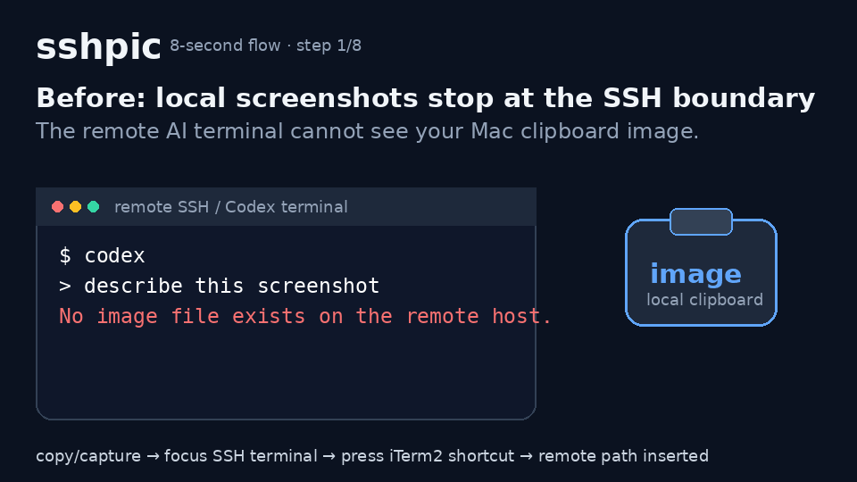

# sshpic

Paste local screenshots into remote SSH coding-agent terminals with normal `Cmd+V`.



## Before / After

| Before sshpic | After sshpic |
|---|---|
| Copy a screenshot, then stop coding to move the file across SSH. | Copy a screenshot and press `Cmd+V` in the SSH session you are already using. |
| Type upload/debug commands after every screenshot. | The paste integration uploads over SSH and inserts only the remote path. |
| Use cloud image links or ad-hoc `scp` workarounds. | Keep screenshots local-to-SSH: no cloud upload and no remote install. |

## Install

### One-liner

```bash
curl -fsSL https://raw.githubusercontent.com/leekyungmoon/sshpic/main/install.sh | bash
```

### From a clone

```bash
git clone https://github.com/leekyungmoon/sshpic.git
cd sshpic
./install.sh
```

The installer builds and installs `sshpic`, prepares the macOS clipboard helper when Homebrew is available, creates config if missing, and enables normal `Cmd+V` image paste in iTerm2. If the local iTerm2 runtime is not ready, install fails before adding a paste hook instead of triggering an iTerm2 popup later.

## Quick Start

After installation, use the terminal exactly the way you already do:

```text
ssh my-host
codex
copy image locally
Cmd+V
```

The Codex input receives a remote path like:

```text
/tmp/sshpic/alice/sshpic-20260704-150405-a1b2c3d4e5f6.png
```

No config editing, snippet printing, iTerm2 settings clicking, or per-screenshot upload command is part of the normal flow.

## How it works

`sshpic` does **path insertion**, not native AI image attachment.

When `Cmd+V` runs in an iTerm2 SSH session:

1. `sshpic` reads the local clipboard.
2. If the clipboard contains an image, `sshpic` detects the foreground local `ssh` target, saves the image to a temp file, uploads it over SSH stdin, and returns the remote path.
3. The remote command creates the directory with `umask 077` and writes the file as mode `0600`.
4. iTerm2 inserts exactly the payload into the focused session input.
5. If the clipboard contains text instead of an image, the original text is inserted exactly once.

Payload mode emits no debug text, shell command, terminal control sequence, or accidental newline.

Codex CLI, Claude Code, or another terminal agent must separately know how to use the inserted path. `sshpic` only guarantees that the image exists on the remote host and that the path is inserted into the active terminal input.

## Support status

| Platform / terminal | Status |
|---|---|
| macOS + iTerm2 | v0.1 target |
| Ubuntu + terminal | TBD |
| Windows / WSL | TBD |
| macOS Terminal.app | TBD |

## Security note

`sshpic` is built for a conservative local-to-SSH workflow:

- No remote install.
- No cloud upload.
- No SSH config mutation by default.
- Uploads use SSH stdin.
- Remote command starts with `umask 077`.
- Remote files are set to mode `0600`.
- Remote paths are shell-quoted.
- Filenames include timestamp + random suffix.
- `sshpic clean` refuses dangerous paths such as `/`, `/tmp`, `$HOME`, `~`, and non-sshpic-specific directories.

Read [docs/security.md](docs/security.md) and [SECURITY.md](SECURITY.md) before using `sshpic` with sensitive screenshots.

## Comparison

| Option | One paste gesture | SSH/private transfer | No background watcher | Notes |
|---|---:|---:|---:|---|
| Manual `scp` / upload command | ❌ | ✅ | ✅ | Reliable, but breaks flow after every screenshot. |
| Cloud image uploader | ✅ | ❌ | ✅ | Easy, but screenshots leave your SSH boundary. |
| Clipboard daemon | ✅ | ✅ | ❌ | Automatic, but keeps a watcher running. |
| `sshpic` | ✅ | ✅ | ✅ | Paste-first flow for remote SSH coding-agent sessions. |

## Roadmap

- Validate fresh macOS+iTerm2 installs across more machines.
- Package Homebrew formula after release validation.
- Add verified Terminal.app, Warp, Ghostty, WezTerm, and Kitty integrations after real tests.
- Add Linux clipboard/screenshot providers after real platform tests.
- Add Windows/WSL provider after real platform tests.

## Troubleshooting

See [docs/troubleshooting.md](docs/troubleshooting.md).

## License

[MIT](LICENSE)
